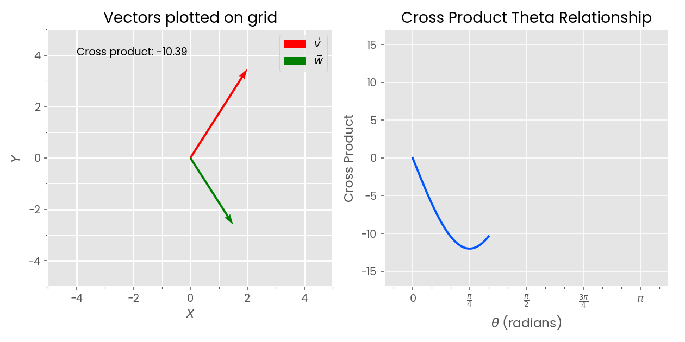

# cross-product-anim

An animation of the cross product of two vectors as they rotate about the origin.

## Example



## Running

```
usage: python3.8 vec.py [-h] mag1 mag2

Show an animation of vector cross products.

positional arguments:
  mag1        Magnitude of vector 1
  mag2        Magnitude of vector 2

options:
  -h, --help  show this help message and exit
```
